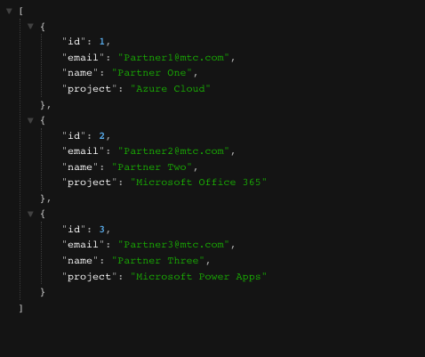
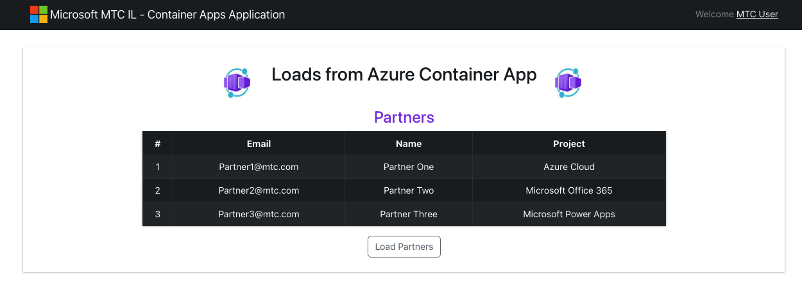

# Container App Workshop

## Architecture


## Table of Contents 
- [Container App Workshop](#container-app-workshop)
  - [Architecture](#architecture)
  - [Table of Contents](#table-of-contents)
  - [Prerequisites](#prerequisites)
- [Steps](#steps)
  - [Create a Resource Group](#create-a-resource-group)
  - [Create a SQL database for partners backend API](#create-a-sql-database-for-partners-backend-api)
  - [Create a Key Vault](#create-a-key-vault)
  - [Store the database credentials in Key Vault](#store-the-database-credentials-in-key-vault)
  - [Create a SPN](#create-a-spn)
  - [Create ACR for Docker Images](#create-acr-for-docker-images)
  - [Dockerizing a Node.js Application](#dockerizing-a-nodejs-application)
  - [Create a Container App](#create-a-container-app)
  - [Store SPN details in Container App Secrets](#store-spn-details-in-container-app-secrets)
  - [Reference Secrets with Environment variables](#reference-secrets-with-environment-variables)
  - [Check your application](#check-your-application)
  - [Hosting Front End application on Azure Blob Storage](#hosting-front-end-application-on-azure-blob-storage)

## Prerequisites
- Azure Subscription
- Azure CLI
- Docker CLI 
- Node 16
- Visual Studio (Community/Enterprise)

# Steps

## Create a Resource Group 
1. Go to Azure Portal
2. Create a resource group - **containerappdemo** in your subscription 

## Create a SQL database for partners backend API
1. Go to Azure Portal
2. Create a resource - SQL Database 
   - ```Subscription``` - Choose your subscription
   - ```Resource Group``` - Choose **containerappdemo** resource group
   - ```Database Name``` - Choose **partnersdb**
   - ```Server``` - Hit Create new
     - ```Server name``` - Choose unique server name for example <yourname><partnersdb>
     - ```Location``` - Choose West Europe
     - ```Authentication method``` - Use SQL authentication and choose admin login and password
     - Hit Ok
     - ```Compute + storage``` - Choose Configure database
       - ```Service tier``` - select DTU-based purchasing model - Basic
       - Change to 1 GB Data max size
       - Hit Apply
     - ```Backup storage redundancy``` - Choose Locally-redundant backup storage
     - Click Next: Networking
     - ```Connectivity method``` - Select Public endpoint (For this demo only) 
       - Allow Azure services and resource to access this tier - Yes. 
       - Add current client IP address - Yes. 
     - Review + create  
     - Create  
   - ```Location``` - Choose your location
   - ```Capacity mode``` - Provisioned throughput
   - ```Apply Free Tier Discount``` - Apply if you want discount   
   - Go to your SQL server blade
   - ```Public network access``` - Selected networks -> Add your ip address 
   - ```Allow Azure services and resources to access this server``` - Check 
3. Go to your database 
4. Choose Query editor in database blade
5. Login with sql server admin credentials 
6. In Query Editor create partners table:
   ```
    CREATE TABLE Partners (
    id int IDENTITY(1,1) PRIMARY KEY,
    email varchar(255) UNIQUE,
    name varchar(255),
    project varchar(255),
    );
   ```
7. In Query Editor create few rows:  
   ```
    INSERT INTO Partners (email, name, project) VALUES ('Partner1@mtc.com', 'Partner One', 'Azure Cloud')
    INSERT INTO Partners (email, name, project) VALUES ('Partner2@mtc.com', 'Partner Two', 'Microsoft Office 365')
    INSERT INTO Partners (email, name, project) VALUES ('Partner3@mtc.com', 'Partner Three', 'Microsoft Power Apps')
   ```

## Create a Key Vault 
1. Go to Azure Portal
2. Create a Key Vault
3. In Key Vault details:
    - ```Subscription``` - Choose your subscription
    - ```Resource Group``` - Choose **containerappdemo** resource group
    - ```Key vault name``` - Choose a unique key vault name
    - ```Region``` - West Europe
    - ```Pricing tier``` - Standard
    - ```Days to retain deleted values``` - 7
4. Review + Create
5. Hit Create 


## Store the database credentials in Key Vault 
1. Go to Your Key Vault 
2. In Key Vault Blade select Secrets 
3. Select Generate/Import 
    - ```Name``` - dbpassword
    - ```Secret value``` - Enter your database password
4. Select Generate/Import
    - ```Name``` - dbuser
    -   ```Secret value``` - Enter your database user
5. Select Generate/Import
    - ```Name``` - dbserver
    -   ```Secret value``` - Enter your database server url - for example <serverName>.database.windows.net
6. Select Generate/Import
    - ```Name``` - dbdatabase
    -   ```Secret value``` - Enter your database name - for example partnersdb
7. Hit Create  

## Create a SPN 
1. Open a Cloud Shell
2. Create a Service Principal with a scope for your resource group
   ```bash
   az ad sp create-for-rbac \
    --name SERVICE-PRINCIPAL-NAME \
    --role Contributor \
    --scopes "/subscriptions/<SUBSCRIPTION_NAME_OR_ID>/resourceGroups/containerappdemo"
   ```
3. Capture and save the service principal output results of the command to use later
   ```bash
    {
    "appId": "YOUR-APP-ID-VALUE",
    "displayName": "YOUR-SERVICE-PRINCIPAL-DISPLAY-NAME",
    "name": "YOUR-SERVICE-PRINCIPAL-NAME",
    "password": "!@#$%",
    "tenant": "YOUR-TENANT-ID"
    }
   ```
4. Give your service principal access to your keyvault 
   ```bash
   az keyvault set-policy \
    --subscription REPLACE-WITH-YOUR-SUBSCRIPTION-NAME-OR-ID \
    --resource-group RESOURCE-GROUP-NAME \
    --name "REPLACE-WITH-YOUR-KEY-VAULT-NAME" \
    --spn YOUR-SERVICE-PRINCIPAL-APP-ID \
    --secret-permissions get list
   ```
5. This service principal will only be able to list all secrets or get a specific secret. You can see this service principal in the Azure portal for your Key Vault

## Create ACR for Docker Images 
1. Go to Azure Portal
2. Create a Container Registry
3. In Registry details:  
    - ```Subscription``` - Choose your subscription
    - ```Resource Group``` - Choose **containerappdemo** resource group
    - ```Registry Name``` - Choose a unique name 
    - ```Location``` - Choose West Europe
    - ```SKU``` - Standard
4. Review + create
5. Create

## Dockerizing a Node.js Application
1. Open Cloud Shell
2. Clone the git repo
3. Open the project - ./nodejs_containerapp_backend_partners_api
4. Change the configuration in database/connection.js file 
5. Build the image and push it to your ACR:
   ```bash
   az acr build --image partners:0.1 --registry <registryName> --file Dockerfile .
   ```


## Create a Container App
1. Go to Azure Portal
2. Create a Container App
3. In Container App details:
   - ```Subscription``` - Choose your subscription
   - Choose **containerappdemo** resource group
   - ```Container app name``` - partners
   - ```Region``` - Choose West Europe
   - ```Container Apps Environment``` - Create new
     - ```Environment name``` - partnersenv
     - ```Zone redundancy``` - Disabled
     - Hit Create
   - Hit Next: App settings
   - Uncheck - Use quickstart image
   - Container Details:
     - ```Name``` - partners
     - ```Image source``` - Azure Container Registry
     - ```Registry``` - Select the registry you created in the last step ( If you get an Error "Cannot access ACR because admin credentials on the ACR are disabled - Go to ACR and enable it - In ACR hit Update and check the Admin user box and hit Save)
     - Select the image: partners 
     - Select the Image tag
     - ```Application ingress settings``` - 
       - Check the Ingress Options
       - Check the Accepting traffic from anywhere
       - ```Target port``` - 8080
     - Hit Create

## Store SPN details in Container App Secrets 
1. Open your container app 
2. In Container App blaid select Secrets 
3. Click +Add 
   - ```Key``` - azureclientid 
   - ```Value``` - Client Id
   - Click Add
4. Click +Add 
   - ```Key``` - azuretenantid 
   - ```Value``` - Tenant Id
   - Click Add
5. Click +Add 
   - ```Key``` - azureclientsecret 
   - ```Value``` - Client Id Secret 
   - Click Add 

## Reference Secrets with Environment variables
1. Open your container app 
2. In Container App blaid select Containers
3. Choose Edit and Deploy 
4. Choose your container image 
5. Go down to Environment variables
6. Reference an environment variable to a secret
  - azureclientid
  - azuretenantid
  - azureclientsecret
7. Hit Save 
8. Hit Create
9. You should run the same revision that you have set your environment variables to

## Check your application 
1. Open your container app 
2. In Container App blaid select Overview 
3. Open Application Url 
4. Go to <Application Url>/api/partners  
        

## Hosting Front End application on Azure Blob Storage
1. Go to Azure Portal
2. Create a resource - Storage account 
3. In Storage account details:  
    - ```Subscription``` - Choose your subscription
    - ```Resource Group``` - Choose **containerappdemo** resource group
    - ```Storage account name``` - Choose a unique name 
    - ```Region``` - Choose West Europe
    - ```Redundancy``` - LRS
4. Hit Review 
5. Hit Create
6. Go to resource
7. In left navigation panel choose ***Static website***
8.  in Static Website details:
   - ```Static website``` - Enabled
   - ```index document name``` - index.html
   - ```Error document path``` - index.html
9.  Hit Save 
10. Copy the Primary Endpoint url 
11. Go your storage account and select ***Storage browser***
12. In Blob containers select $web - It is the place where you upload a website.  
13. Clone the git repo
14. Open the project - ./react_frontend_website_no_authentication
15. Edit Api.js file and change the baseUrl to your container app url 
16. Run ```npm install```
17. Run ```npm run build``` - Build a project and store it in a build directory
18. Upload all files to $web directory in a storage account 
19. In left navigation panel choose ***Static website***
20. Copy the ***Primary endpoint*** url and test in your web browser
21. Test the Web  
     
